|  |  |
|---|---|

# Vishal Kumar

**AI/LLM Analyst · Fullstack (MERN) Developer · Builder**

---

### 👋 About Me

- 🔭 Analyst — **AI/LLM Practice** @ Innodata India, Noida
- 🎓 B.Tech Computer Science, MMDU (2021–2025)
- 🛠️ Building **MultiSolution** — a home services marketplace (MERN stack)
- 🤖 Exploring Kafka + LLM + microservices architectures
- 🌱 Currently learning Django (coming from a MERN background)
- 💬 Ask me about React, Node.js, MongoDB, LLM tooling

---

### 🧰 Tech Stack

---

### 🚀 Featured Projects

| Project | Description |
|---|---|
| **MultiSolution** | Home services marketplace (Urban Company-style) — MERN monorepo, JWT auth, city-based routing |
| **Kafka Order Pipeline** | Event-driven microservices (API Gateway, Orders, Payments, Inventory, Notifications) on Redpanda |
| **TechFuel** | AI/tech learning platform — Next.js, TypeScript |
| **Aria Voice Assistant** | Flask + Anthropic API voice assistant with Web Speech API + Google TTS |

---

### 🐍 Contribution Graph

### 📊 GitHub Stats

